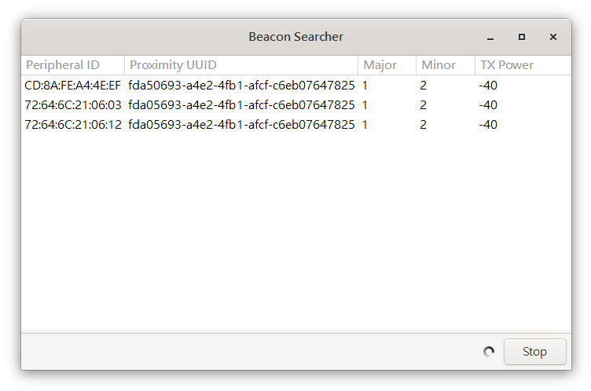

# iBeacon Searcher

## Screenshot




## Compile & Run

1. Install GTK 3 dev packages:
    - Debian / Ubuntu:
        ```
        $ sudo apt install libgtk-3-dev build-essential
        ```
    - Windows:

        1. Install dev packages from `MSYS2 Shell`:
            ```
            $ pacman -S --needed base-devel mingw-w64-x86_64-toolchain
            $ pacman -S mingw-w64-x86_64-gtk3
            ```
        2. Edit environment variable:
            - add `C:\msys64\mingw64\bin` to `Path`.
            - add `C:\msys64\mingw64\lib` to `GTK_LIB_DIR`.

        3. Add toolchain target, open a `PowerShell`, and run:
            ```
            PS C:\> rustup target add x86_64-pc-windows-gnu
            ```
        4. Change toolchain target:
            ```
            PS C:\> rustup default stable-x86_64-pc-windows-gnu
            ```
        5. Check default toolchain target:
            ```
            PS C:\> rustup show
            ...
            stable-x86_64-pc-windows-gnu (default)
            stable-x86_64-pc-windows-msvc 
            ...
            ```
2. Clone this repo, and `cd` to repo directory.
3. Run app:
    ```
    $ cargo run
    ```


## License

MIT License
